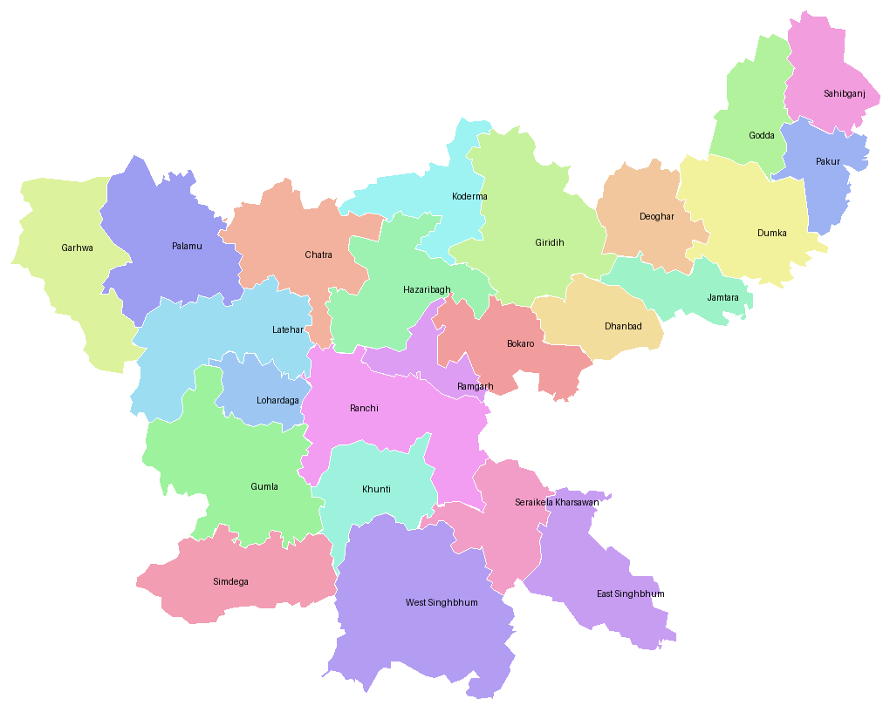

# Jharkhand district map

The risk map in the app draws Jharkhand's 24 districts from
`android/app/src/main/java/in/sajag/geo/JharkhandMap.kt`. That file is
generated by the two scripts here. Do not edit it by hand.



## Source and licence

District boundaries: **"India - District Map" (Census 2011 districts)** by the
DataMeet India community, <https://github.com/datameet/maps>, shared under
[Creative Commons Attribution 2.5 India](https://creativecommons.org/licenses/by/2.5/in/).

We cut out the districts where `ST_NM` is `Jharkhand`, simplified each outline
with Douglas-Peucker (epsilon 0.002 of the map width, about 2 px on a 1000 px
wide map) and projected them equirectangular at the state's middle latitude.
The result is good for a risk picture, not for surveying. The app credits the
source under the map itself and in Settings, under About.

## Regenerate

```bash
git clone --depth 1 https://github.com/datameet/maps /tmp/datameet-maps
cd tools/jharkhand-map
python3 convert.py /tmp/datameet-maps/Districts/Census_2011/2011_Dist 0.002   # writes jharkhand.json
python3 gen_kotlin.py                                                          # writes JharkhandMap.kt
```

No packages are needed: `shp.py` reads the shapefile and its dBase table
directly. `jharkhand.json` is kept in the repository, so `gen_kotlin.py` can be
rerun without the shapefile. With the files as committed, both steps reproduce
`JharkhandMap.kt` byte for byte.

`JharkhandMapTest.kt` checks the result: 24 unique districts, every label inside
its own district, ten real towns (Dhanbad, Ranchi, Jamshedpur, Bokaro, Chaibasa
and others) landing in the right district through `Jharkhand.project()`, and
Kolkata landing in none.
